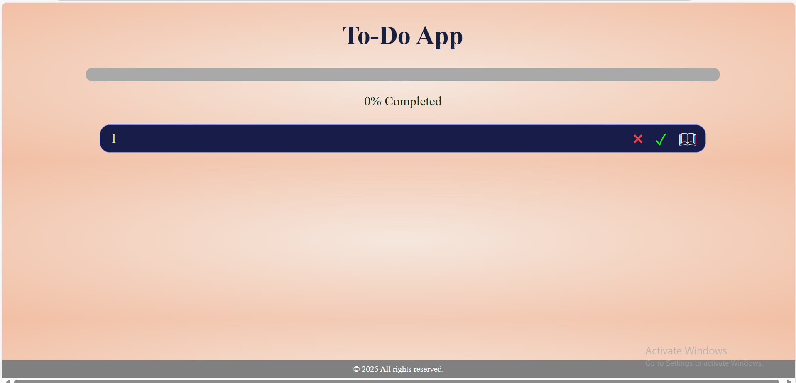
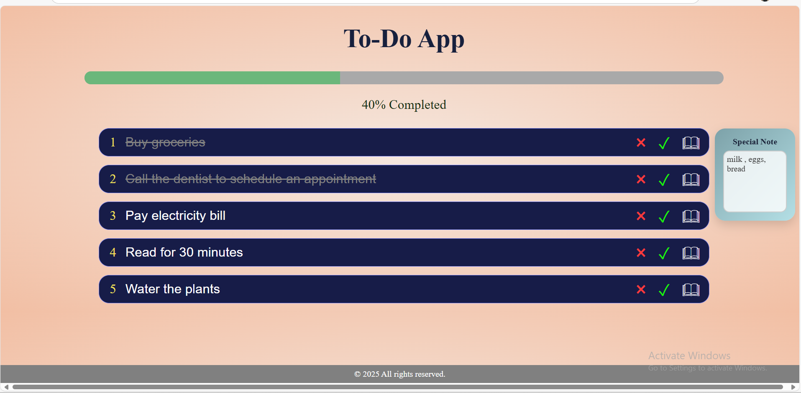
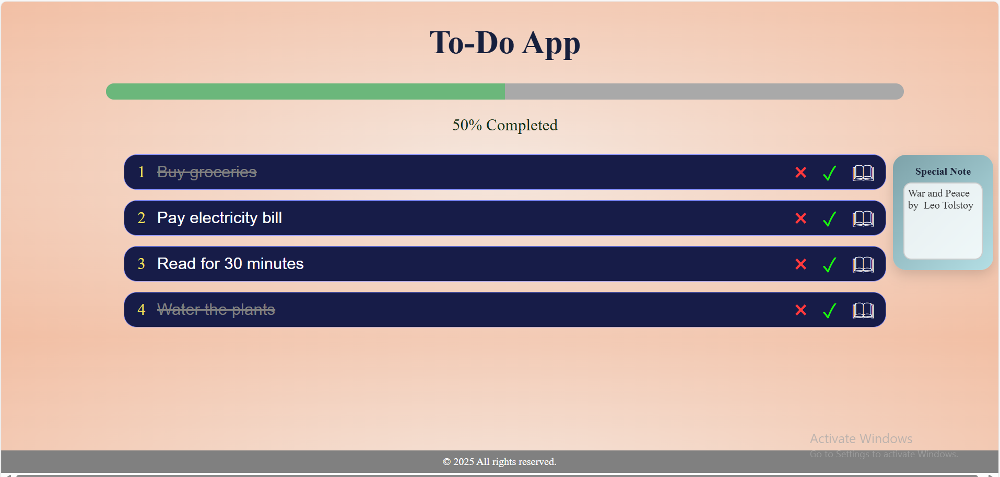

# 📋 ToDO_AppTask

A simple and efficient task management app built with React and Vite, 
Designed to help organize, track, and manage daily tasks easily.

---

## 📸 Screenshots





---

## ✨ Features

- ✅ Add new tasks
- ✏️ Edit existing tasks
- ✔️ Mark tasks as completed using a checkmark button
- 🗒️ Add special notes to tasks
- ❌ Remove tasks
- 📊 Visual progress bar to track completed tasks

---

## 🚀 Getting Started

Follow these steps to run the project locally:

```bash
git clone https://github.com/mihiran12/ToDo_AppTask
cd ToDo_AppTask
npm install
npm run dev

